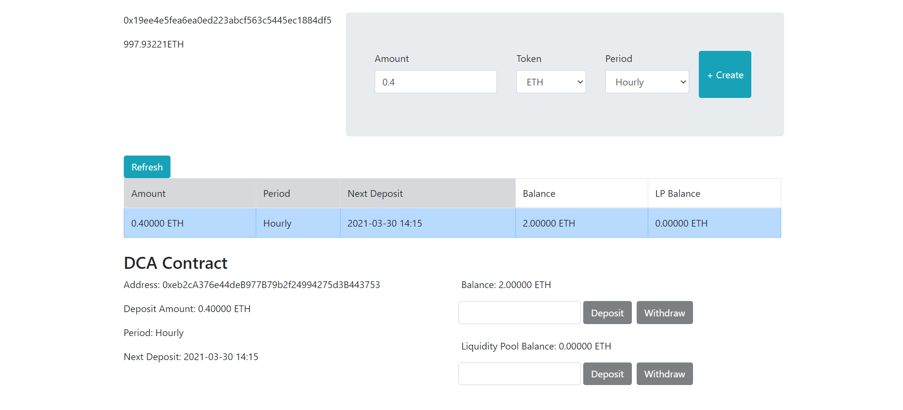

# DCA Automator

The DCA Automator creates smart contracts in Ethereum that deposit periodically an amount of ETH or ERC20 tokens in a liquidity pool.



## What’s Included?

* [Ethereum DCA Smart Contracts](./smart-contracts)
* [Keeper](./keeper)
* [React Client](./client)

## Quick start

Start by downloading the project.
```sh
$ git clone https://github.com/fabiodmferreira/dca-automator.git
$ cd dca-automator
```

### Deploy smart contracts

Enter smart contracts directory.
```sh
$ cd smart-contracts
```

Install dependencies
```sh
$ npm install
```

Set `INFURA_ID` in your system environment variables or create the `.env` with next content.
```
INFURA_ID=<your infura node id>
```

Run the Buidler's testing network.
```sh
npm run launch-node
```

On a new terminal, go to `smart-contracts` directory and deploy the contracts.
```sh
npm run deploy-contracts
```

The deploy scripts added the contracts addresses and the ABI files to `client/src/contracts` and `keeper/contracts`, so they can interact with the contracts deployed.

### Launch client

Make sure you have [Metamask](https://metamask.io/) installed.

Enter client directory.
```sh
$ cd client
```

Install dependencies.
```sh
$ npm install
```

Run the client server.
```sh
$ npm start
```

It will popup a tab in your browser with the url `http://localhost:3000`. Here you will have to connect with your metamask account and you will be able to create your smart contracts that will deposit tokens in Aave liquidity pools.

**Note:** Metamask may popup an invalid nonce error the first time you sign a transaction. Reset your account in Metamask settings (`Settings > Advanced > Reset Account`) to fix this issue. The nonce cached will be reset.

### Keeper

The keeper is a daemon service that inspects for dca contracts that allow to transfer tokens to the liquidity pools.

Enter keeper directory.
```sh
$ cd keeper
```

Install dependencies.
```sh
$ npm install
```

Run the keeper.
```
$ npm start
```

